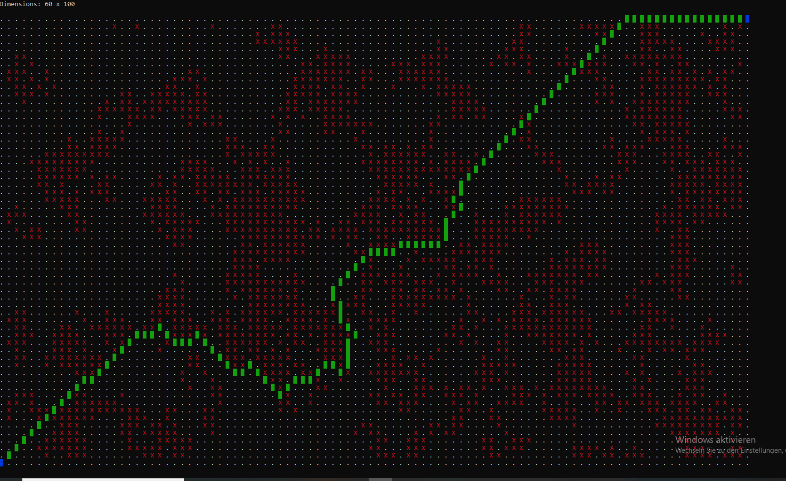

# Dijkstra-Maze
Generate a random maze and use Dijkstra's shortest path to find a way from one side to the other. Display the maze and the found path in the command prompt.

Works on Windows. The maze includes <windows.h> to change foreground and background console colors to draw the maze and the path through it. The program can still be compiled and executed on other OSs, it just won't display any colors.

